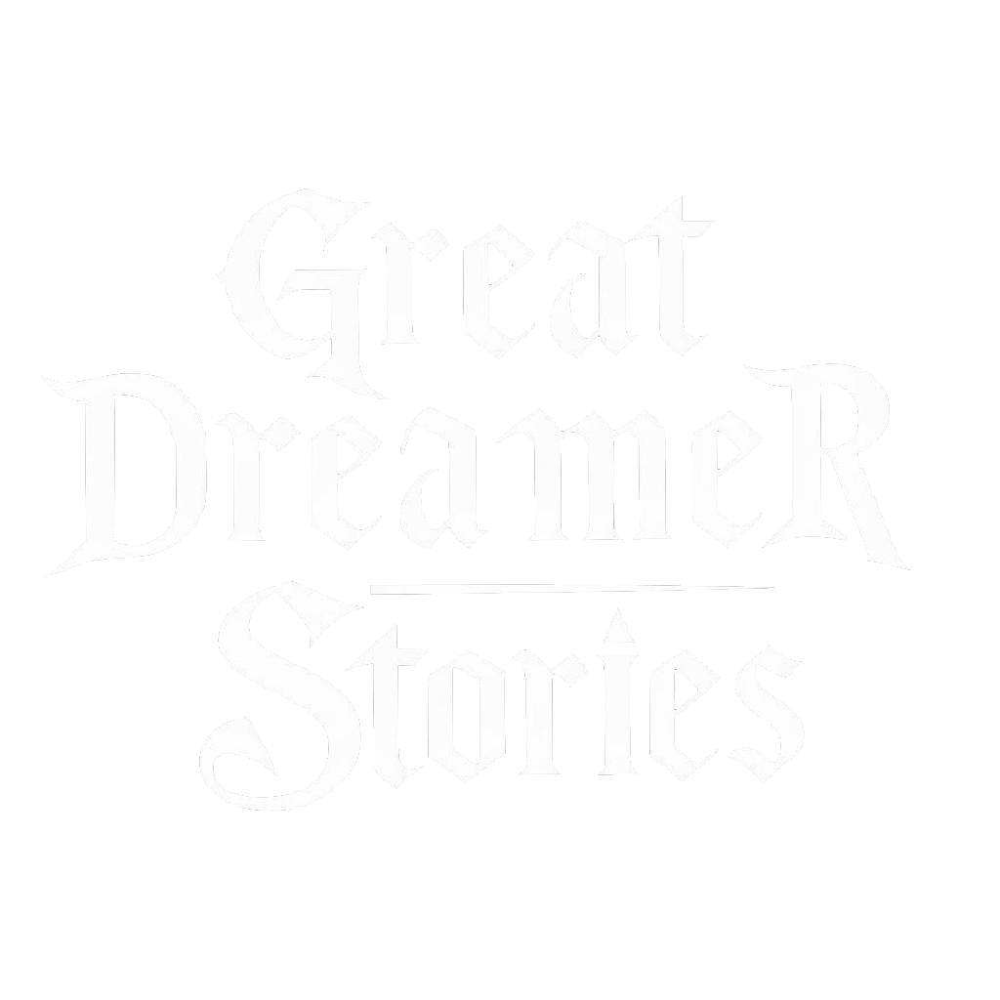

<p align="center">
  
</p>

Great Dreamer Stories is an indie game project built on **Call of Cthulhu–style** stats and skills, wrapped in a **retro isometric RPG** loop: explore a **tiled winter map**, then fight in a **dedicated tactical battle view**. **Noire**-inspired tone shapes the **environment and visuals** — lonely, grounded, desaturated Nordic noir. The story unfolds in a modern Scandinavian town where you are the local police chief, investigating the psychological and the supernatural through **exploration, locations, and investigation systems**.


## 🎮 Overview

Great Dreamer Stories is powered by a custom-built game engine, the CthulhuEngine, developed for this project to support **isometric exploration**, **turn-based tactical combat**, **investigation and inventory**, and narrative consequence. The engine is designed for flexibility and extensibility (branching story state, NPC behaviour hooks, audio-visual integration). You can add **additional stories** the player tackles in sequence; each story is a self-contained RPG arc, after which the character can grow.

## 📋 Current State

The game is in a very early stage with a working main menu (including atmosphere and audio), character creation and selection, and a simple save/load system.

The main gameplay view is still a placeholder: it shows character stats, skills, and panels that foreshadow the **dossier / investigation UI**; the real **isometric map** and **tactical battle** views are not implemented yet.

## 🛠️ Development Requirements

### Java Development Kit (JDK)

- **Required**: **JDK 17** (matches `build.gradle` `sourceCompatibility` / `release` and the `jpackage` step in distribution scripts)
- **Download**: [Eclipse Temurin](https://adoptium.net/), [Oracle JDK](https://www.oracle.com/java/technologies/downloads/), or another JDK 17 distribution

### Build Tool

- **Gradle** (via the included wrapper): `gradlew` / `gradlew.bat` in the repository root — no separate Gradle install required

### Audio

- Playback uses **LibGDX** (`Music` / `Sound` via `Gdx.audio`) on the **LWJGL3** desktop backend
- Dependencies and native libraries are resolved by **Gradle** from Maven Central (there is no manual `lib/` copy step in this repo)

## 🚀 Quick Start

### 1. Clone the Repository

```bash
git clone <repository-url>
cd GreatDreamerStories
```

### 2. Run the Game

**From the repo root (recommended):**

```bash
./gradlew run
```

On Windows **Command Prompt or PowerShell**, use:

```bat
gradlew.bat run
```

**From Cursor / VS Code:** use the **Launch Great Dreamer Stories** or **Debug Great Dreamer Stories** configuration (F5 / Ctrl+F5 on Windows). The project supplies `.vscode/launch.json` and a **Compile Great Dreamer Stories** pre-launch Gradle task.

If the IDE launch fails, run `./gradlew compileJava` (or `gradlew.bat compileJava` on Windows) once and try again.

## 📦 Creating Distributions

Packaging uses **`jpackage`** (included with the JDK) plus Gradle to stage the JAR, classpath, and `res/` assets. Run the script **on each OS** you want to target (it detects the platform and writes under `dist/<platform>/`).

### Compile

```bash
./run-scripts/compile.sh
```

This runs `./gradlew compileJava`. On Windows without Bash, use `gradlew.bat compileJava` instead.

### Build a Native App Image

```bash
./run-scripts/distribute.sh --no-version-bump
```

For non-interactive CI, pass **`--patch`**, **`--minor`**, **`--major`**, or **`--no-version-bump`** (see script `--help`). Version is read from `gradle.properties` (`version=…`) and reflected in packaged builds.

### Distribution Output

After a successful Windows build, you get an **app-image** folder named like:

`dist/windows/GreatDreamerStories v.<version>/`

The launcher executable is **`GreatDreamerStories.exe`** inside that folder. Linux and macOS builds land under `dist/linux/` and `dist/macos/` respectively, with the same versioned folder naming.

The image includes the staged JAR, runtime dependencies, game `res/` assets, and the native launcher produced by `jpackage`.

## 🔧 Configuration

### Editor Settings

The project includes `.vscode/settings.json` for Java/workspace integration where applicable.

### Launch Configuration

`.vscode/launch.json` wires the game main class `atomiccode.greatDreamerStories.Launcher` to the Gradle compile task for run and debug.

## 🤝 Contributing

1. Fork the repository
2. Create a feature branch
3. Make your changes
4. Test on multiple platforms where you can
5. Submit a pull request

## 📄 License

This project is licensed under the MIT License — see the [LICENSE](LICENSE) file for details.

## 🙏 Acknowledgments

- [Tabletop Audio](https://tabletopaudio.com/) for audio files
- Game development community for inspiration and feedback
- All supporters and beta testers
